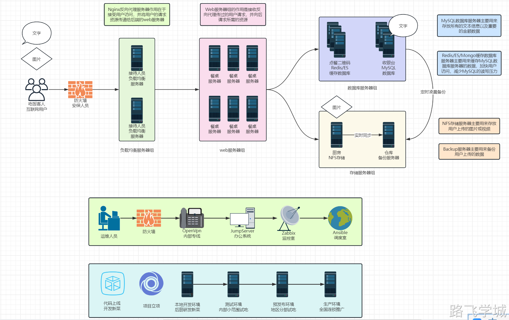
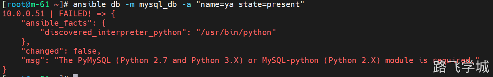
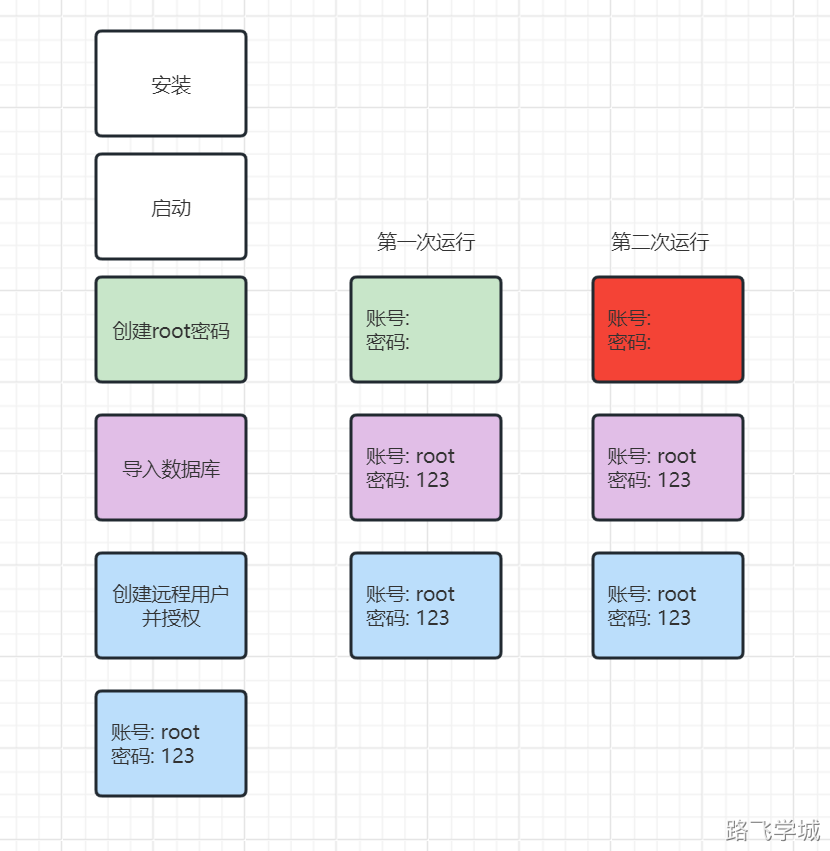
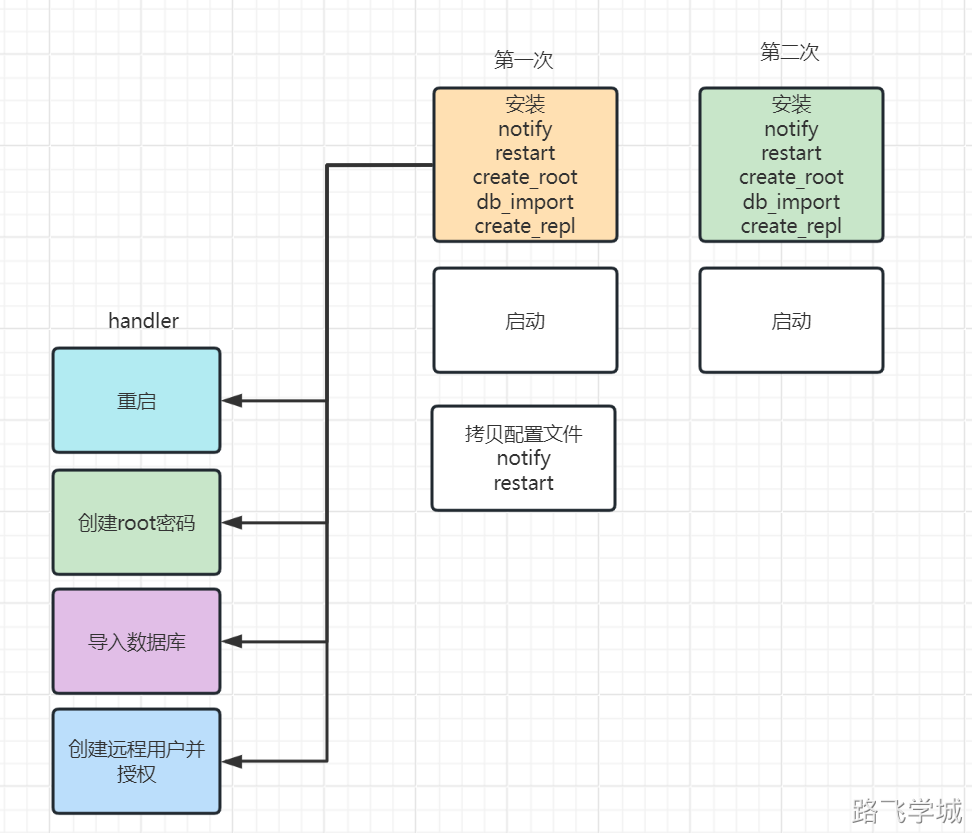

# 综合架构试炼说明


**yum内网仓库：**

链接：https://pan.baidu.com/s/1-rVdaYKKYS79cRtclvlLhw?pwd=0pn3 

提取码：0pn3 

--来自百度网盘超级会员V9的分享

#### 0.项目架构图



#### 1.必做项目-所有人必须完成

1）项目文档(PPT)+项目架构图
2）ansible一键安装整个集群,m-61不用还原
3）web-7和web-8部署Tomcat+Nginx
4）nfs-31共享+backup-41实时同步
5）db-51部署MariaDB数据库

备份：

mysqldump -uroot -p123 -B zrlog > zrlog.sql

导出：

mysql -uroot -p123 < zrlog.sql


6）lb-5和lb-6实现反向代理+负载均衡+高可用+https

#### 2.提高项目-完成必做项目的基础上

1）ntp时间服务器
2）zabbix监控，只监控基础项即可，能实现邮件报警更厉害了
3）数据库主从复制
4）跳板机jumperserver(功能强 消耗大 至少4G内存)或者teleport（功能简单，内存消耗小）
5）openvpn内网专线

#### 3.狠人项目-不可能，绝对不可能

1）阿里云上完成综合架构（按量付费）
2）docker运行LNMT
3）ELK日志收集分析平台

#### 4.重要声明

1）所有服务器除了lb服务器以外，其他服务器都通过内网互联
2）ansible所在的管理机上的服务不需要重头做，不要求一键自动安装，可以提前都做好
3）zabbix能打开web页面，能监控一台主机，只监控基本项即可，zabbix数据库装在m-61就行
4）项目文档和画图必须要做
5）如果基础项没完成，拓展项一律不算分
6）备份！备份！备份！

## 第2章 时间规划建议

1）下周1述职，7天时间
2）先做基础项，基础项没做完不用做拓展项目，反正后面也会讲
3）基础项完成可以挑战拓展项目


基础同学：

第1天  不要碰Ansible，先手动完成并且调通，收集好所有的步骤和配置文件

第2天  不要碰Ansible，先手动完成并且调通，收集好所有的步骤和配置文件

第3天  开始写Ansible，从后往前做，nfs，backup

第4天  继续写Ansible，web服务器，lb服务器

第5天  开始调试，全部还原快照，完整跑一边Ansible

第6天  开始写PPT

第7天  完善PPT，练习口述


拓展同学：

zabbix

openvpn

jumpserver

## 第3章 机器配置建议

m-61             基础项 2-4G  拓展项 4G-8G
lb-5                512m
lb-6                512m 
web-7            512m
web-8            512m
nfs-31            512m
backup-41     512m
db-51            512m
db-52            512m

## 第4章 述职流程

0.上台自我介绍，然后先运行ansible
1.先讲解一下自己的架构图
2.叙述用户访问网站流程（流畅，简单）
 \- 域名
 \- DNS
 \- TCP/IP三次握手(说不清楚可以不说)
 \- HTTP请求报文
 \- HTTP响应报文
 \- 常见HTTP状态码
 \- lb服务器如何负载均衡
 \- web服务器如何处理请求静态资源/动态资源
 \- 图片挂载NFS-实时同步
 \- 请求数据库
 \- 数据库主从同步
 \- TCP/IP四次挥手
 
3.演示环节
 web页面
 \- https打开网站是否可以显示，显示是否正常
 \- 写一篇文章，上传一个图片
 \- 看nfs里有没有图片，看backup里有没有图片
 \- 验证数据是存在了db-51上
 
 lb服务器
 \- 演示使用的是VIP访问
 \- 演示关掉一台，VIP是否会漂移
 \- 恢复机器，看VIP是否回去
 \- 网站始终都能打开
 
 db服务器
 \- db-51创建数据库，db-52可以同步创建
 
 ntp时间服务器
 \- ntpdate 172.16.1.61
 
 yum仓库
 \- 查看一下客户端是否只有一个local源
 
 jumpserver
 \- 使用跳板机连接到内网的服务器终端
 
 zabbix-4.0版本
 \- 打开web页面，客户端在线，显示绿色
 \- 如果配置了报警，可以演示一下能否收到报警邮件
 
 openvpn
 \- windwos连接上oenvpn
 \- 使用172地址打开zabbix页面
 
4.你的辛酸历程
 \- 自己心理的变化
 \- 时间安排
 \- 哪些怀疑人生的坑
 \- 印象最深的报错 
 \- 你对运维的看法
 \- 你对一年后自己想说的话
 
5.感谢环节
 \- 感谢帮助过你的同学
 
6.提问环节
 控制在35-50分钟

## 第5章 抄作业

#### 1.代码怎么做？

web-7和web-8是一模一样的，什么叫一模一样？就是所有东西都是一模一样的

先手动连接web-7把数据库信息配置上去，能正常打开网页，然后将代码目录打个包，复制给m-61

然后还原web-7和web-8的机器

#### 2.JDK怎么做？

只需要解压即可，不需要创建软链接

因为tomcat的启动文件里已经写了JDK的环境变量

## 第6章 综合架构锦囊妙计 

### 妙计1：Ansible部署JDK和Tomcat

误区：

Ansible部署JDK和Tomcat的时候不需要往/etc/profile里写JDK的环境变量，因为Tomcat的systemd启动文件里已经指定了JDK的绝对路径

```bash
cat > /etc/systemd/system/tomcat.service << 'EOF'
[Unit]
Description=Apache Tomcat Web Application Container
After=network.target

[Service]
Type=forking

Environment=JAVA_HOME=/opt/jdk			# 这里已经指定了JDK的环境变量路径了，所以JDK不需要在/etc/profile里再写一遍了，Tomcat启动就能识别
Environment=CATALINA_PID=/opt/tomcat/temp/tomcat.pid
Environment=CATALINA_HOME=/opt/tomcat
Environment=CATALINA_BASE=/opt/tomcat
Environment='CATALINA_OPTS=-Xms512M -Xmx512M -server -XX:+UseParallelGC'
Environment='JAVA_OPTS=-Djava.awt.headless=true -Djava.security.egd=file:/dev/./urandom'

ExecStart=/opt/tomcat/bin/startup.sh
ExecStop=/opt/tomcat/bin/shutdown.sh

User=www
Group=www
RestartSec=10
Restart=always

[Install]
WantedBy=multi-user.target
EOF
```

### 妙计2：Ansible使用MySQL模块管理数据库

#### 官方文档：

https://docs.ansible.com/ansible/latest/collections/community/mysql/index.html

#### 讲解视频：


#### 难点1：

Ansible的mysql模块管理mysql数据库需要安装python依赖模块



解决：注意，两台服务器都安装

 yum install MySQL-python  -y

#### 难点2：

Ansible使用MySQL模块名称不是  community.mysql.mysql_db，而是 mysql_db:  否则会报错

#### 难点3：

刚安装完的MySQL没有账号密码，但是设置密码后，Ansible的剧本任务并没有改变，所以导致第二次执行会因为没有密码而报错

如果是直接导入SQL文件，其实已经包含了帐号密码，所以其实不需要连接的时候使用账号密码


解决：

Ansible的handlers并不是只能执行一个任务，也不是只能执行restart，而是所有任务都可以放在handlers里执行，关键是触发的时机。


逻辑：

传输SQL文件，如果这个动作有改变，就认为是第一次安装，触发创建root密码，导入数据库，创建远程帐号等任务。

传输SQL文件，如果这个动作没有改变，就认为不是第一次安装，就不会触发创建root密码，导入数据库，创建远程帐号等任务。





#### 参考配置


### 妙计3：Ansible管理MySQL懒人方法

可以直接把MySQL的数据目录打个包然后发过去目标服务器，解压后启动服务直接可以用。
