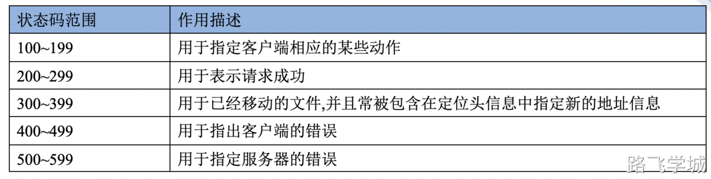

# 网络基础

## 局域网通信流程

## 网站域名

#### 1.什么是域名?

简单理解,域名就是我们所说的网址

#### 2.为什么需要域名?

方便人记忆,人记不住IP地址,所以起个好记的名字

#### 3.域名购买注意

域名可以交易

域名越短越贵越容易被记住

## DNS域名解析

#### 1.什么是DNS

DNS是域名系统 (Domain Name System) 的缩写

它作为可以将域名和IP地址相互映射的一个分布式数据库，能够使人更方便的访问互联网

而不用去记住能够被机器直接读取的IP。

#### 2.DNS域名结构
www.abc.com

.  		根域

com		一级域名/顶级域

abc         二级域名

www	三级域名

#### 3.常见的DNS顶级域

cn	 中国

com  全球互联网

org    非盈利组织

edu   教育组织

gov   政府

#### 4.DNS解析记录

A记录			IPV4记录，支持将域名映射到IPv4地址使用

@记录			当用户不输入三级域时候的默认解析地址

CNAME记录		别名记录，支持将域名指向另外一个域名

#### 5.DNS解析流程

## CDN内容分发网络

#### 1.CDN介绍

内容分发网络（Content Delivery Network，CDN）是建立并覆盖在承载网上，由不同区域的服务器组成的分布式网络。将源站资源缓存到全国各地的边缘服务器，供用户就近获取，降低源站压力。

#### 2.CDN特点

就近访问

全国节点

回源站点

热点资源缓存

热点资源预热

#### 3.CDN工作原理

## TCP协议

#### 1.TCP协议特性

##### 1） 面向连接

TCP 是一种面向连接的协议，意味着通信的两个应用程序在数据传输开始之前必须先建立连接。这个过程通常涉及三次握手（three-way handshake）来建立连接：

- **SYN（同步）**: 客户端发送一个 SYN 数据包到服务器，并进入 SYN_SENT 状态。
- **SYN/ACK（同步确认）**: 服务器响应一个 SYN/ACK 数据包，确认客户端的 SYN。
- **ACK（确认）**: 客户端发送一个 ACK 数据包给服务器，一旦这个数据包被接收，连接就被建立了。

##### 2）可靠性

TCP 提供可靠的服务，其中几个机制确保数据正确无误地传输：

- **确认和重传**: 发送的每个数据包都需要对方的确认。如果确认没有在预定时间内到达，发送方将重传数据包。
- **数据排序**: TCP数据包头部包含一个序号，接收方用它来重组来自发送方的数据包的正确顺序。
- **错误检测**: TCP头部还包含一个校验和，用于检测数据在传输过程中是否被破坏。

##### 3）流量控制

TCP 使用滑动窗口机制来进行流量控制。这允许发送方根据接收方的处理能力来调整数据的发送速率，从而防止接收方的缓冲区被溢出。

##### 4） 拥塞控制

当网络拥塞时，TCP 通过减少数据的发送速率来响应。这涉及几种算法，如慢启动、拥塞避免、快速重传和快速恢复，这些都是为了优化网络的整体性能并防止过度拥塞。

##### 5） 保持活动检测

TCP 提供保持活动功能，允许定期检查对端是否仍然可达，这有助于维持应用程序之间的连接不被无意中关闭。

##### 6）优雅的关闭

TCP连接的终止也是一个四次握手过程，确保双方都完成了数据的发送和接收。

通过这些机制，TCP支持互联网上的众多应用，如Web浏览、文件传输、电子邮件等，确保数据的准确传输和网络效率。

#### 2.TCP报文格式

重点：端口号是TCP报文的内容

#### 3.TCP三次握手-建立连接

为了建立一个可靠的连接，TCP使用了一个称为“三次握手”（Three-way handshake）的过程，这个过程可以确保双方都准备好进行数据传输。下面是TCP三次握手的详细步骤：

详细描述：

1. **第一次握手（客户端发送SYN）**:

- - 客户端决定发起一个新的连接时，会向服务器发送一个SYN（同步序列编号）报文。这个报文不仅标志了SYN标志位设为1，还包含了客户端的初始序列号（ISN）。此时，客户端进入SYN_SENT状态，等待服务器的响应。

1. **第二次握手（服务器发送SYN-ACK）**:

- - 服务器接收到客户端的SYN报文后，会发送一个SYN-ACK报文段作为响应。这个报文段中既设定了ACK标志位也设定了SYN标志位，其中确认号（ACK Number）为客户端的序列号加1（表示确认收到客户端的SYN），并包含服务器自己的初始序列号。服务器此时进入SYN_RECEIVED状态。

1. **第三次握手（客户端发送ACK）**:

- - 客户端接收到服务器的SYN-ACK报文后，会向服务器发送一个ACK报文段，其中确认号为服务器的序列号加1。发送这个ACK报文后，客户端的状态变为ESTABLISHED，表示客户端到服务器的连接正式建立。服务器在收到这个ACK报文后，也将状态变为ESTABLISHED。

简单描述：

客户端：SYN=1，seq=x

服务端：SYN=1，ACK=1，seq=y，ack=x+1

客户端：ACK=1，seq=x+1，ack=y+1

#### 4.TCP四次挥手-断开连接

TCP四次挥手（Four-way handshake）是TCP协议中用来终止一个已建立的连接的过程。这个过程确保了双方都能完成数据传输并正确关闭连接。

TCP四次挥手是TCP连接断开过程中的标准步骤，用于确保两个通信方向的数据传输都已完成，并且双方都同意关闭连接。以下是四次挥手的具体步骤：

1. **第一次挥手（客户端发起关闭）**:

- - 客户端决定要关闭连接时，会向服务器发送一个FIN（Finish）标志位设为1的报文段。这个报文段还包含一个序列号，表示客户端发送的最后一个字节的序列号。此时，客户端进入FIN_WAIT_1状态，表明它已经没有数据要发送给服务器了，但是在等待服务器的确认。

1. **第二次挥手（服务器确认）**:

- - 服务器接收到客户端的FIN报文后，会向客户端发送一个ACK（Acknowledgment）报文作为响应，确认序列号为客户端FIN报文的序列号加1，表示服务器已经收到了客户端的关闭请求。服务器此时可能还有数据需要发送给客户端，所以它不会立即关闭连接，而是进入CLOSE_WAIT状态。客户端收到这个ACK后，会进入FIN_WAIT_2状态，继续等待服务器关闭连接的信号。

1. **第三次挥手（服务器发起关闭）**:

- - 当服务器确定自己也没有数据需要发送给客户端时，会向客户端发送一个FIN报文，告诉客户端它也可以关闭连接了。服务器这时进入LAST_ACK状态，等待最后一个ACK的到来。

1. **第四次挥手（客户端确认并关闭）**:

- - 客户端收到服务器的FIN报文后，会向服务器发送一个ACK报文作为响应，确认序列号为服务器FIN报文的序列号加1。客户端进入TIME_WAIT状态，等待足够长的时间（通常是2倍的最大段生存期，即2MSL），以确保最后一个ACK报文能够到达服务器，避免出现旧的数据包在网络中延迟到达而引起混淆。服务器收到这个最终的ACK后，就会关闭连接，进入CLOSED状态。客户端在等待期间结束后也会进入CLOSED状态，至此，TCP连接彻底关闭。

整个四次挥手的过程保证了连接的可靠关闭，双方都能确认对方已经没有数据发送，并且各自的资源可以被正确地释放。

四次挥手简单描述：

客户端：FIN=1,seq=x

服务端：ACK=1,ack=x+1

服务端：FIN=1,seq=y

客户端：ACK=1,ack=y+1

关于2MSL：

2MSL（Maximum Segment Lifetime）是TCP连接中定义的时间常数，代表TCP报文在网络中能够存在的最大时间。MSL的具体值取决于网络和系统的实现，但通常设定为2分钟。因此，2MSL就是4分钟。

这个时间段被用在TCP四次挥手的过程中，特别是在客户端进入TIME_WAIT状态时。客户端在TIME_WAIT状态下等待2MSL的时间，以确保最后发送的ACK报文能够被服务器收到，防止服务器没收到ACK需要重传FIN报文。此外，这个等待期还确保了网络中可能存在的旧报文段都会因超过生命周期而自动消失，从而避免了新的连接中出现旧数据的问题。

#### 5.TCP的11种状态

TCP协议定义了11种状态来描述连接的生命周期，这些状态包括：

1. CLOSED（关闭）
2. LISTEN（监听）
3. SYN_SENT（同步已发送，客户端状态）
4. SYN_RECEIVED（同步已接收，服务端状态）
5. ESTABLISHED（已建立）
6. FIN_WAIT_1（终止等待1）
7. FIN_WAIT_2（终止等待2）
8. CLOSE_WAIT（关闭等待，被动关闭方状态）
9. CLOSING（关闭中）
10. LAST_ACK（最后确认）
11. TIME_WAIT（时间等待）

这些状态反映了TCP连接从建立到断开的整个过程中各个阶段。

#### 6.数据封装过程

#### 7.数据解封装过程

## HTTP协议

#### 1.HTTP协议介绍

HTTP（超文本传输协议）是用于在互联网上传输数据的基础协议，它定义了客户端（如浏览器）与服务器之间的通信规则。HTTP 是无状态协议，意味着每次请求之间相互独立，服务器不会保存之前的交互信息。

HTTP 的主要特点包括：

1. **简单性**：HTTP 使用易于阅读的ASCII格式发送命令，使得协议简单易懂。
2. **可扩展性**：HTTP 允许传输任何类型的数据对象。通过MIME类型标识数据的类型。
3. **无状态**：为了提高性能，HTTP 自身不保存状态信息。不过，可以通过如 Cookie 的技术在无状态的连接中保存状态。
4. **连接方式**：大多数HTTP通信是通过无连接的方式进行的，即每次连接只处理一个请求和响应。HTTP/1.1 开始支持持久连接。

HTTP请求和响应的结构主要包括：

- **请求行**：包含方法（如 GET、POST）、请求的资源的URI和HTTP版本。
- **响应行**：包含状态码（如 200 表示成功，404 表示未找到）和HTTP版本。
- **头部字段**：包括各种设置和属性，如内容类型、缓存控制等。
- **消息体**：请求或响应的实际数据内容。

随着Web的发展，HTTP也在不断进化，例如HTTP/2和HTTP/3提供了更高效的连接、更好的性能和更低的延迟。

#### 2.HTTP请求方法

#### 3.HTTP请求报文

#### 4.HTTP响应报文

#### 5.HTTP响应状态码

状态码分类：

常见状态码：

## 用户访问流程总结

## 相关面试题
- 说一下OSI七层模型和TCP/IP四层模型，有什么区别？ 
- 说一下TCP三次握手和四次挥手流程。 
- 说一下TCP协议和UDP协议的区别是什么？ 
- 说一下交换机和路由器分别工作在OSI模型的第几层？ 
- 说一下IP地址和端口号分别属于什么协议？工作在第几层？ 
- HTTP的请求报文有哪些内容？ 
- HTTP的响应报文有哪些内容？ 
- HTTP的请求方法有哪些？ 
- HTTP常见状态码有哪些？ 
- 什么是域名？域名和IP地址的关系是什么？ 
- 域名如何购买？购买时需要注意什么？ 
- 购买完的域名如何与服务器的IP进行绑定？ 
- 什么是DNS协议？作用是什么？ 
- DNS协议有哪些常用记录类型？ 
- 什么是A记录和CNAME记录？ 
- 什么是CDN？CDN的作用是什么？ 
- 用户访问网站的完整流程是什么？
- #面试题